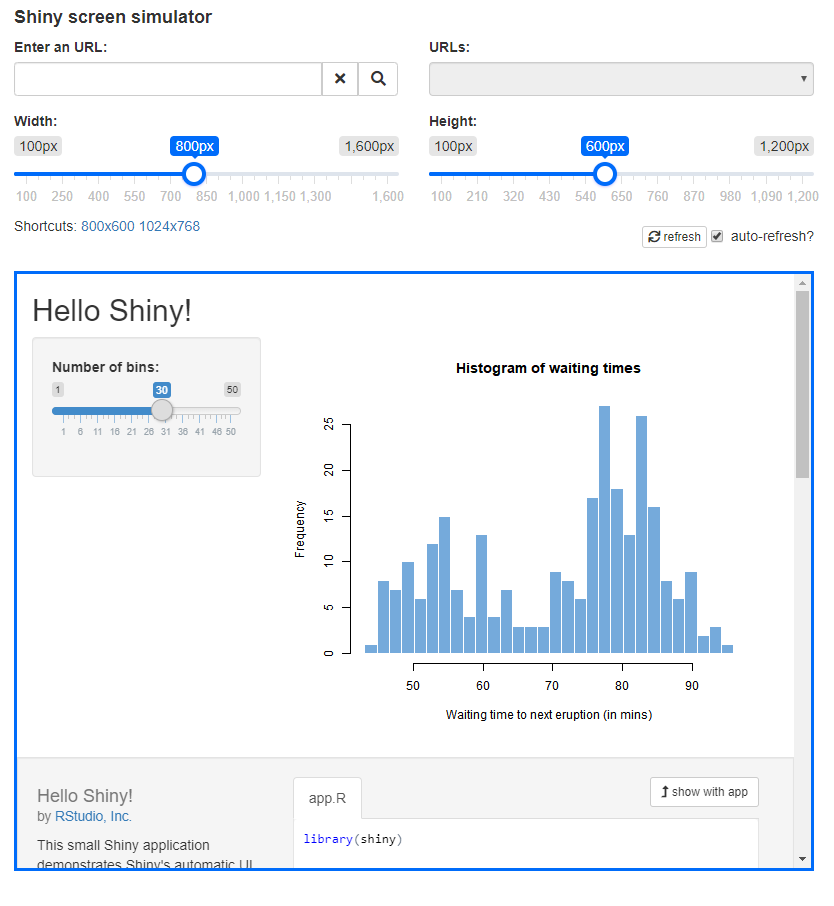

# resizer

> Simulate screen resolution for Shiny apps. When developing applications, the display may be different depending on the screen on which the application is displayed. This application allows you to simulate different resolutions to verify that the display is correct.

<!-- badges: start -->
[](https://www.tidyverse.org/lifecycle/#experimental)
<!-- badges: end -->


:warning::warning::warning:

This is a POC to discuss with [@DivadNojnarg](https://github.com/DivadNojnarg), the goal is to see how we can merge this with [`shinyMobile::preview_mobile()`](https://rinterface.github.io/shinyMobile/reference/preview_mobile.html).


## Installation

You can install the development version from GitHub with:

```r
# install.packages("devtools")
devtools::install_github("dreamRs/resizer")
```

## Example

Launch your app (or the Hello demo from shiny) in a resizable iframe :

```r
library(resizer)
emulate_resolution(
  system.file("examples", "01_hello", package = "shiny")
)
```




